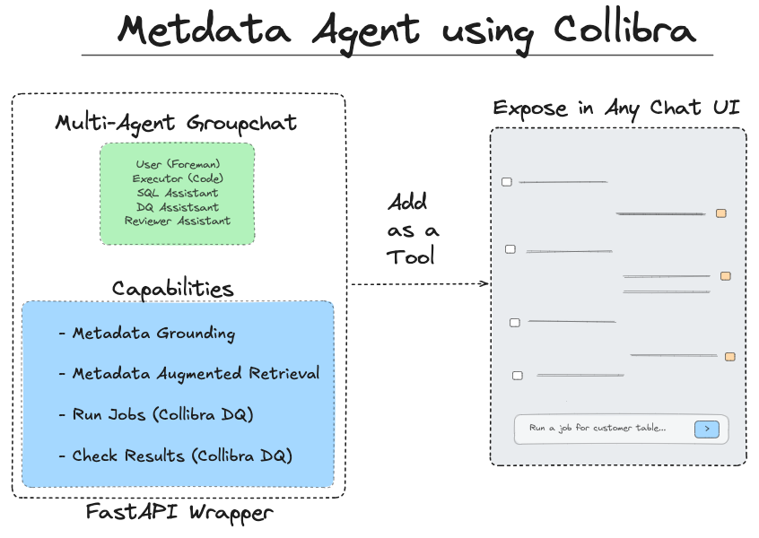
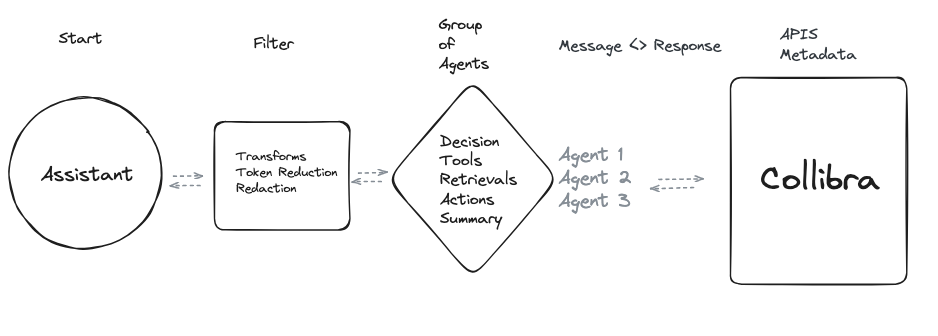

# Metadata Agent (Chat API)

> **Disclaimer**: Just a demo, not officially supported product of Collibra

A FastAPI-based chat application that provides persistent chat sessions with AI agents.



## Features

Multiple Agents:
- Human Agent: Uses proxy mode for automation, modify for human-in-the-loop
- Metadata Agent: Grounding and Search (via Duckdb Engine)
- Data Quality Agent: Data Quality Operations (via Collibra DQ)
- Code Executor Agent: Execution of specific Python and SQL Functions
- Reviewer Agent: Reviews Memory and Context 

API Layer: 
- Message history available as chat_history (JSON messages) in response payload
- Multiple AI model support (Gemini, OpenAI, etc.)
- Persistent chat sessions across requests
- Trailing context memomory window
- Transform and Redaction method 
- Error handling and logging
- Health check endpoint
- CORS support

Previous Notebook: https://drive.google.com/file/d/1Sh8WKPM27aUVoTdC-vm0RdQUTXoETpDW/view



Notebook Walkthrough: https://www.linkedin.com/posts/brianmearns_multi-agents-tools-collibra-productivity-activity-7262880388434255873-V3DU?utm_source=share&utm_medium=member_desktop&rcm=ACoAAADiXgwBS06Bt07oAQt6uGXK9qqXyN47Jxw

## Installation

1. Clone the repository:
```bash
git clone <repository-url>
cd metadata-agent
```

2. Create a virtual environment and activate it:
```bash
python -m venv venv
source venv/bin/activate  # On Windows: venv\Scripts\activate
```

3. Install dependencies:
```bash
pip install -r requirements.txt
```

4. Set up environment variables:
```bash
cp .env.example .env
# Edit .env with your configuration
```

## Running the Application

Start the FastAPI server:
```bash
uvicorn app.main:app --reload
or
uvicorn main:app --reload --host 0.0.0.0 --port 8000 --workers 1

```

The API will be available at `http://localhost:8000`

## API Endpoints

### Health Check
```bash
curl http://localhost:8000/api/v1/health
```

### Start or Continue a Chat Session
```python
import requests

# Start a new chat session
response = requests.post(
    "http://localhost:8000/api/v1/chat",
    json={
        "prompt": "Hello, how can you help me?",
        # session_id will be auto-generated if not provided
    }
)

# Get the session ID from the response
session_id = response.json()["session_id"]

# Continue the chat using the same session
response = requests.post(
    "http://localhost:8000/api/v1/chat",
    json={
        "prompt": "What's next?",
        "session_id": session_id  # Use the same session_id for continuity
    }
)
```

### Clear a Chat Session
```python
response = requests.post(
    "http://localhost:8000/api/v1/clear",
    json={
        "session_id": session_id
    }
)
```

## Response Examples

### Chat Response
```json
{
    "message": "AI response message",
    "session_id": "550e8400-e29b-41d4-a716-446655440000",
    "context": {
        "recent_context": "Previous conversation context..."
    }
}
```

### Clear Session Response
```json
{
    "success": true,
    "message": "Successfully cleared session 550e8400-e29b-41d4-a716-446655440000"
}
```

### Error Response
```json
{
    "message": "An error occurred processing your request",
    "session_id": "550e8400-e29b-41d4-a716-446655440000",
    "error": "Error details"
}
```

## TODO
- Add Slack Example
- Add Tool Examples for other platforms
- Add LLM providers available in notebook (Currently only OpenAI and Gemini)
- Session handler with JWT
- Citation formatting
- Add more agent actions
- Editable prompts 
- Add Docker steps for deployment

## Development

### Project Structure
```
metadata-agent/
├── app/
│   ├── __init__.py
│   ├── main.py
│   ├── api/
│   │   ├── __init__.py
│   │   └── routes.py
│   ├── core/
│   │   ├── __init__.py
│   │   ├── config/
│   │   │   ├── __init__.py
│   │   │   ├── environment.py
│   │   │   └── models.py
│   │   ├── config.py
│   │   ├── session.py
│   │   └── logging.py
│   ├── services/
│   │   ├── __init__.py
│   │   ├── chat_service.py
│   │   └── sql_service.py
│   ├── agents/
│   │   ├── __init__.py
│   │   ├── base_agent.py
│   │   ├── agent_config.py
│   │   └── agent_factory.py
│   ├── chat/
│   │   ├── __init__.py
│   │   └── chat_manager.py
│   ├── tools/
│   │   ├── __init__.py
│   │   ├── dq_tools.py
│   │   ├── sql_tools.py
│   │   └── job_tools.py
│   └── models/
│       ├── __init__.py
│       └── models.py
├── data/
│   ├── connection_schema.csv
│   ├── actions.csv
│   └── actions_with_embeddings.csv
├── notebooks/
│   ├── notebook_quick_start.ipynb
│   ├── notebook_create_embeddings.ipynb
│   ├── notebook_create_csv.ipynb
│   ├── notebook_tool.ipynb
│   └── notebook_full_examples.ipynb
├── requirements.txt
├── .env.example
└── README.md
```

### Customizing Connection Schema

To customize the connection schema for your environment, you'll need to modify the `data/connection_schema.csv` file. This file contains the mapping of your database connections and their configurations. The easiest way to do this is using the `notebook_create_csv.ipynb` notebook:

1. Open `notebook_create_csv.ipynb` in Jupyter Notebook or JupyterLab
2. Follow the notebook instructions to:
   - Define your database connections
   - Set Collibra DQ API config
   - Generate the appropriate connection, schema, table csv
   - Save the configuration to `data/connection_schema.csv`


Make sure to update your `.env` file with any necessary credentials referenced in your connection strings.

### Contributing
1. Fork the repository
2. Create a feature branch
3. Commit your changes
4. Push to the branch
5. Create a Pull Request
